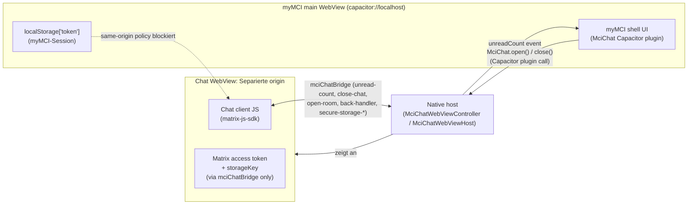

# myChat
Sicherer Chat in der myMCI, auf Basis von Matrix

---

# Problemstellung

Aktuell fehlt uns ein **niedrigschwelliger, sicherer Kommunikationskanal**:
- In erster Linie für Incomings: 
	- Keine Kommunikation zwischen Aufnahme und Studienbeginn
	- Absagen von 10-15%

---

# Problemstellung (2)

Auch zur studentischen Vernetzung **vor, während und nach** dem Studium
- Wohnungssuche
- Start-Up-Gründung
- Buddy-Programm
- ...etc...

- e.g. Kim Fladda meldete schon Interesse an, diesen Kanal für **reguläre Studienanfänger:innen** aus dem Ausland zu nutzen.

---
# Fokus
**-> Kommunikationsplattform für Incomings**

"Vertrauenswürdige" Incomings erhalten schon früher als bisher Zugriff auf unsere IT-Infrastruktur.

"Vertrauenswürdig" heißt: 
- LA bereits eingereicht (TBD!)
- Max. 12 Monate vor Ankunft (laut IRO reicht auch 6... wird noch entschieden)
- Max. 6 Monate nach Abreise

---

# Fokus (2)

- Aktuell wird von IRO ein **WhatsApp-Chat** bespielt (etwa: Wohnbörse, allgemeine Kurzinfos, Erinnerungen, etc.) -> suboptimal!
- **Von IRO vorgeschlagen**: Plugin von **Studo**, welches diesen Use-Case abdecken soll.
- Wir kontern mit **Matrix**.

---

# Matrix vs Studo

|                         | Studo-Plugin                            | Matrix                                         |
| ----------------------- | --------------------------------------- | ---------------------------------------------- |
| Hosting der Nachrichten | beim Anbieter                           | matrix.mci4me.at, MCI-eigen                    |
| Kosten                  | Lizenz, laufend, pro Kopf (?)           | Betrieb bestehender Infrastruktur              |
| Lock-in                 | Anbieter kontrolliert Daten und Roadmap | offenes Protokoll, Client austauschbar         |
| Interoperabilität       | geschlossen                             | ein Account, Element im Browser + myChat mobil |
| Lifecycle               | keine Ahnung                            | wir setzen die Regeln selbst                   |
| Verfügbarkeit           | nein                                    | Matrix läuft schon bei uns                     |
Kaum Infos zum Plugin, zentrale Fragen wurden beim letzten Meeting **nicht** geklärt. Studo-Beauftragter **Johannes Waldner** fehlte beim letzten Termin.

---

# Matrix in a nutshell

-> kein "Produkt" in dem Sinne, sondern ein offenes Protokoll. Vgl. E-Mail!

- Dezentralisiert, MCI betreibt Homeserver via matrix.mci4me.at
- Clients gibt's zuhauf: MCI-eigene Webinstanz von _Element_ auf chat.mci4me.at.
- E2EE per default, implementiert den ursprünglich fürs Signal-Protokoll entwickelten **Double Ratchet Algorithm**

---

# Vorgehensweise
- Klarzustellen: **Ab wann** können wir den Incomings einen **mci4me-Account** verpassen?
- **Konfiguration** der existierenden Infrastruktur
	- Erstellen von sog. Spaces bzw. Rooms
	- Permission-Management
	- Lifecycles anpassen
	- Danach: Technisch gesehn ready-to-go?
- **myChat** als integrierten, minimalen Client in die myMCI

---

# myChat -- Architektonische Überlegungen

Genau genommen eine separate App:

- Eigener Login (user-facing bis SSO viable wird)
- Eigene secrets (Login-Token und Crypto-Store)
- Calls zu matrix.mci4me.at, nicht zum Designer
- Eigene Content Security Policy
- Push-Notifikationen werden separat gehandled
- ...
- Vor allem aber: Vergleichsweise hohes XSS-Potenzial.

Daher erscheint mir eine separate WebView ziemlich sinnvoll.
Es gibt mMn. keinen Grund, warum sich die Be Beiden eine Origin (und damit Zugriff auf u.A. localStorage und den myMCI-Token) teilen sollen.

**In Browserversion:** Link auf Element-Webinstanz. Done!

---
# CSP

-> Allowlist!
- Woher duerfen Ressourcen geladen werden?
- In unsrem Fall: Nur von unserer eigenen Chat-Origin

---
# Bridge

iOS: mci-chat://localhost
Android: https://chat.mci-local -> Android kennt lokale custom schemes nicht an, wir faken eine fiktive https:// -URL.

---
# Keystore
## Problem: 
m.login.password muenzt ein neues Device mit leerem crypto store -> verschluesselte Nachrichten gehen nach jedem Login verloren!

## Loesung:
-> Key-Backup!
- verschluesselte Kopie des Megolm-Keys auf Homeserver gespeichert
- Zur Entschluesselung dieser Keys: **4S!** (server-side secret storage)
	- Ein secret storage key wird am Client generiert
	- Die secrets (Key backup key, aber auch cross-signing keys) werden verschluesselt
	- Die verschluesselten Blobs werden als Account-Data am Homeserver hinterlegt
	
---
## Loesung (2):
Um diese Daten wiederrum zu erhalten -> Recovery-Key

- Wird im nativen secure storage gespeichert und mittels rust-crypto bzw. matrix-js-sdk hinterlegt und abgerufen
- Aktuell: Keine UI zum manuellen Speichern des Keys! Limitierungen:
	- Re-Logins ohne Re-Install behaelt die Keys
	- Neuinstallation loescht sie -> Ohne zweite Session sind die Nachrichten weck!
	- Kommt aber noch.

---

# Encryption-Trust
- Chat-Client ist isoliert von myMCI
- Token und Key-DB sind encrypted-at-rest
- Restriktiv definiert, was und woher der Chat ausfuehren, fetchen und in die DOM injecten kann

-> All das schuetzt die **on-device secrets** und **innerhalb des Clients**!

---

E2EE ist nicht genug. Die Trust Layer kuemmert sich um folgende Frage:

> Mit welchen Devices und Identitaeten teilen wir Keys? Wessen Nachrichten sind vertrauenswuerdig?

Durch:
- Cross-Signing -> "Master-Key", per-Account-Identitaet
- Geraeteverifizierung -> Short Authentication String, Emojis
- Backup der Keys
- Device Isolation -> Key sharing mit unverified devices?
- Downgrade protection -> Verschluesselung eines Raumes bleibt unveraendert, sonst: Refusal!

---
![[Screenshot_20260727_174836.png]]

---

![[2026-07-27_17-49.png]]

---

![[Screenshot_20260727_175017.png]]

---
# TOFU
-> Trust On First Use!

Neue Identitaeten werden bei der ersten Sichtung als vertrauenswuerdig eingestuft.
Passiert, wenn der Cross-Signing-Key veraendert wurde. Eventuell bei Neuinstallation oder anderwertigen Verlust des Recovery Keys -- oder wenn wir mit einem Impostor kommunizieren!

![[Red-impostor.webp]]

Daher: Alert! Die Identitaet wurde veraendert! Willst du wirklich mit dieser Person kommunizieren?!

---
# "Warum nicht einfach Element in einer WebView laufen lassen?"

Gute Frage! Waere die einfache Loesung -> Laeuft schon auf chat.mci4me.at, hoeheres Sicherheitsniveau.

Aber:
- auf Speicherebene des In-App-Browsers beschraenkt
	- kein Hardware-Keychain/Keystore moeglich
	- keine nativen Push-Nachrichten
- kein Branding