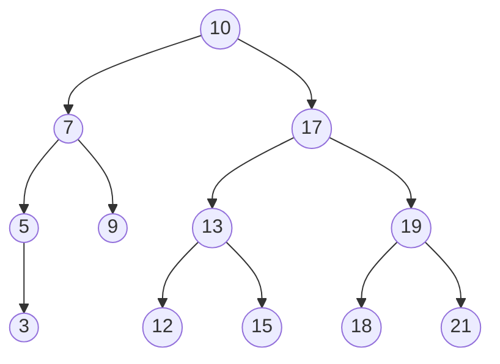

# Binärer Suchbaum
-> _BST_

Ein binärer Suchbaum ist ein binärer Baum, wenn für alle Knoten im Baum gilt,
dass alle Knoten im linken Unterbaum einen kleineren Schlüssel und alle Knoten
im rechten Unterbaum einen größeren Schlüssel als die (Unter)Wurzel besitzen.

-> ein [[Binäre Baumstrukturen|binärer Baum]] für den gilt, dass alle Knoten im

- <mark style="background: #FF5582A6;">linken Unterbaum</mark> einen <mark style="background: #FF5582A6;">kleineren Schlüssel</mark>
- <mark style="background: #ADCCFFA6;">rechten Unterbaum</mark> einen <mark style="background: #ADCCFFA6;">größeren Schlüssel </mark>

als die **(Unter)Wurzel** besitzen.

Der Schlüssel wird hier im Knoten gespeichert! Vereinfacht kann man **Key = Data** annehmen, wobei der Key eindeutig sein muss.

----------------------------------------
**Beispiel**:

M = {10, 7, 5, 17, 19, 3, 9, 13, 21, 12, 15, 18}

## Operationen

* insert(Node n)
* delete(Node n)
* find(Key k)
* print(Tree)

Im **worst-case** haben _insert/delete/find_ eine Laufzeit von

$$\begin$$

