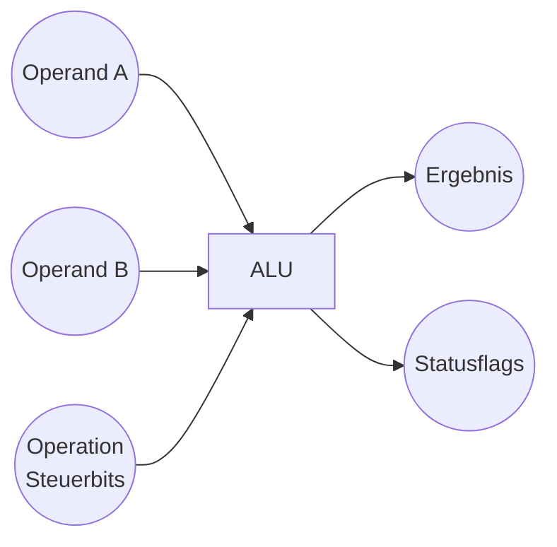

-> führt die **arithmetischen** und **logischen** Operationen eines Prozessors aus. 

[[Teile-und-Herrsche-Prinzip]]! ALUs setzen sich aus kleineren Schaltungen zusammen (z.B. Addierer, [[Logik-Gatter]]).

Damit bildet sie den Kern vieler Rechenvorgänge in einer [[CPU]].

---

## Was ist eine ALU (Arithmetic Logic Unit)?

Die **ALU** (Arithmetic Logic Unit) ist eine zentrale Komponente einer CPU. Sie ist verantwortlich für:
* **Arithmetische Operationen**: Addition, Subtraktion, Inkrement, Dekrement
* **Logische Operationen**: AND, OR, NOT, XOR etc.
* **Vergleiche**: (z.B. Prüfung auf Gleichheit, Größenvergleich)

Wird vom Prozessor eine entsprechende Instruktion ausgeführt, übernimmt die ALU das Rechnen bzw. Bewerten und stellt das Ergebnis bereit.

---

## Aufbau und Funktionsweise

Eine ALU lässt sich in verschiedene Teilkomponenten zerlegen:

1. **Addierer/Subtrahierer**: Realisiert mit Hilfe von [[Logik-Gatter|Logikgattern]] wie AND, OR, XOR und NOT. Ein typisches Beispiel ist der **Volladdierer**.
2. **Logikeinheit**: Führt bitweise Operationen (AND, OR, XOR, NOT etc.) durch.
3. **Shifter** (optional): Ermöglicht Links- oder Rechtsverschiebungen von Bits.
4. **Steuerlogik**: Entscheidet anhand der Steuerbits (z.B. OP-Code) darüber, welche Operation aktuell ausgeführt werden soll.

Das [[Teile-und-Herrsche-Prinzip]] zeigt sich bei ALUs deutlich: Aus einfachen Grundbausteinen (z.B. Gattern, Addierern) wird eine komplexe Funktionseinheit zusammengesetzt.

---

## Beispielhafter Schaltplan (Mermaid)

- **Operand A** und **Operand B** werden der ALU zugeführt.
- **Steuerbits** (OP) legen fest, ob z.B. addiert, subtrahiert oder eine logische Verknüpfung durchgeführt wird.
- **OUT** ist das Ergebnis, das zum weiteren Gebrauch (z.B. ins Register oder Speicher) geliefert wird.
- **FLAGS** signalisieren Informationen wie Überlauf, Null-Flag oder Negativ-Flag.

---

## Operationsbeispiele

- **Addition**: A + B  
  Verwendung eines oder mehrerer Volladdierer-Module
- **Subtraktion**: A - B  
  Oft realisiert als A + (NOT B) + 1 (Zweierkomplement)
- **Logische Verknüpfung**:  
  * A AND B  
  * A OR B  
  * A XOR B  
- **Vergleiche**:  
  * Überprüfung, ob (A - B) == 0 → Null-Flag  
  * Überprüfung des Überlaufs

---

## Zusammenfassung

* Die ALU ist die **Recheneinheit** in jedem modernen Prozessor.
* Sie basiert auf **Logikgattern** und **Addierern**, welche wiederum über das [[Teile-und-Herrsche-Prinzip]] aus einfachen Bausteinen zusammengesetzt sind.
* Das Verständnis von ALUs ist grundlegend, um zu begreifen, wie ein Computer mit Zahlen und logischen Zuständen umgeht.

