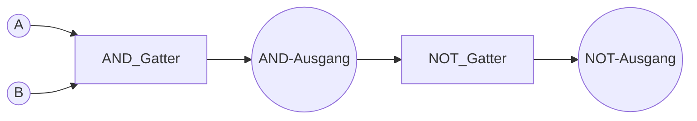

-> elektronische Schaltung zur realisierung einer **boolschen Funktion.**

[[Teile-und-Herrsche-Prinzip]]! Einfachere Schaltungen als Grundbausteine komplizierterer.

So kann man etwa 
* aus den **Grundoperatoren** (AND, OR, NOT,...) einen Addierer bauen,
* aus welchem man eine **Arithmetic Logic Unit** (ALU),
* welche wiederrum Teilbaustein der [[CPU]] ist,
* welche unverzichtbarer Bestandteil eines jeden Computers ist.

---

## Grundlegende Logikgatter

Logikgatter verknüpfen logische Zustände (typischerweise 0 oder 1) und liefern ebenfalls 0 oder 1 als Ausgang. Sie sind die Hardware-Umsetzung der Booleschen Algebra.
### AND-Gatter
- **Funktion**: Liefert nur dann 1 am Ausgang, wenn **alle** Eingänge 1 sind.
- **Wahrheitstabelle**:

| A | B | A AND B |
|---|---|---------|
| 0 | 0 |    0    |
| 0 | 1 |    0    |
| 1 | 0 |    0    |
| 1 | 1 |    1    |

### OR-Gatter
- **Funktion**: Liefert 1 am Ausgang, wenn **mindestens einer** der Eingänge 1 ist.
- **Wahrheitstabelle**:

| A | B | A OR B |
|---|---|--------|
| 0 | 0 |   0    |
| 0 | 1 |   1    |
| 1 | 0 |   1    |
| 1 | 1 |   1    |

### NOT-Gatter (Inverter)
- **Funktion**: Kehrt das Eingangssignal um (1 wird 0, 0 wird 1).
- **Wahrheitstabelle**:

| A | NOT A |
|---|-------|
| 0 |   1   |
| 1 |   0   |

### NAND-Gatter
- **Funktion**: Liefert 0 am Ausgang, **nur wenn alle Eingänge 1** sind. In allen anderen Fällen ergibt es 1. (Negation des AND)
- **Wahrheitstabelle**:

| A | B | A NAND B |
|---|---|----------|
| 0 | 0 |    1     |
| 0 | 1 |    1     |
| 1 | 0 |    1     |
| 1 | 1 |    0     |

### XOR-Gatter (Exklusives ODER)
- **Funktion**: Liefert 1, wenn **genau einer** der Eingänge 1 ist, sonst 0.
- **Wahrheitstabelle**:

| A | B | A XOR B |
|---|---|---------|
| 0 | 0 |    0    |
| 0 | 1 |    1    |
| 1 | 0 |    1    |
| 1 | 1 |    0    |

### XNOR-Gatter
- **Funktion**: Liefert 1, wenn beide Eingänge **gleich** sind. Das ist das Gegenteil vom XOR.
- **Wahrheitstabelle**:

| A | B | A XNOR B |
|---|---|----------|
| 0 | 0 |    1     |
| 0 | 1 |    0     |
| 1 | 0 |    0     |
| 1 | 1 |    1     |

---

## Beispielhafter Schaltplan (Mermaid)

In diesem Beispiel wird zuerst eine UND-Verknüpfung von zwei Eingängen **A** und **B** durchgeführt. Deren Ausgang wird anschließend durch ein NOT-Gatter invertiert.

---

## Weiterführendes

- **NAND-Gatter** und **NOR-Gatter** sind universelle Gatter, da man mit ihnen alle anderen Gatter nachbauen kann.
- **XOR-Gatter** liefert 1, wenn genau ein Eingang 1 ist (exklusives Oder).
- **XNOR-Gatter** liefert 1, wenn beide Eingänge gleich sind.
- Mithilfe dieser Grundgatter lassen sich:
  1. **Addierer** (z.B. Halb- und Volladdierer) konstruieren
  2. Komplexere Einheiten wie **[[l** in Prozessoren realisieren
  3. Vollständige **[[CPU|CPUs]]** mit verschiedenen Steuer- und Recheneinheiten aufbauen

So zeigt sich deutlich das [[Teile-und-Herrsche-Prinzip]]: Aus einfachen Grundbausteinen entstehen hochkomplexe elektronische Systeme.