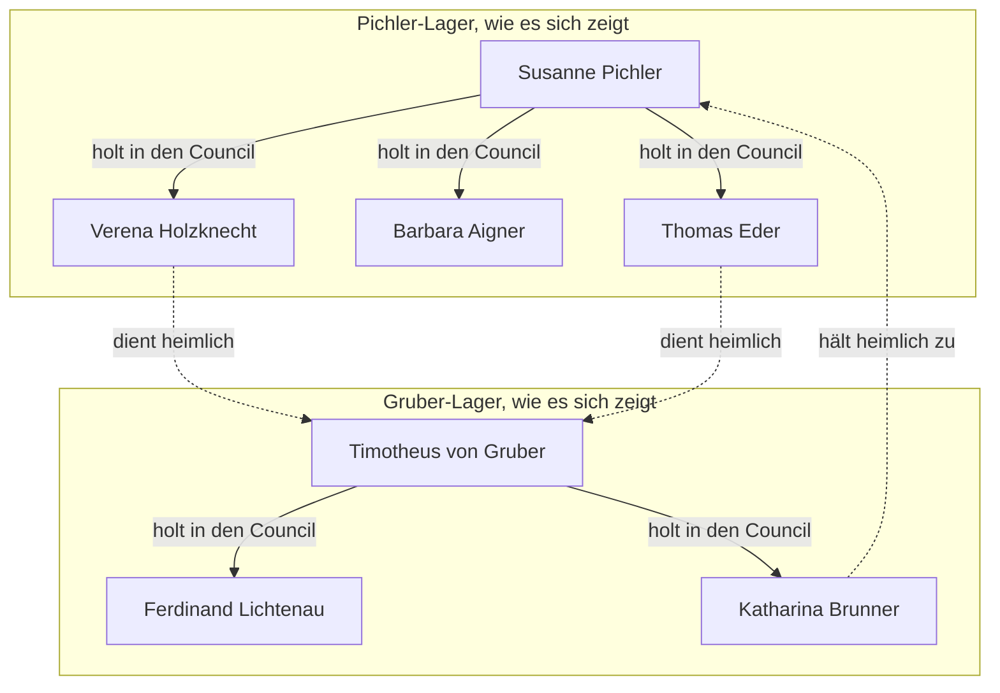
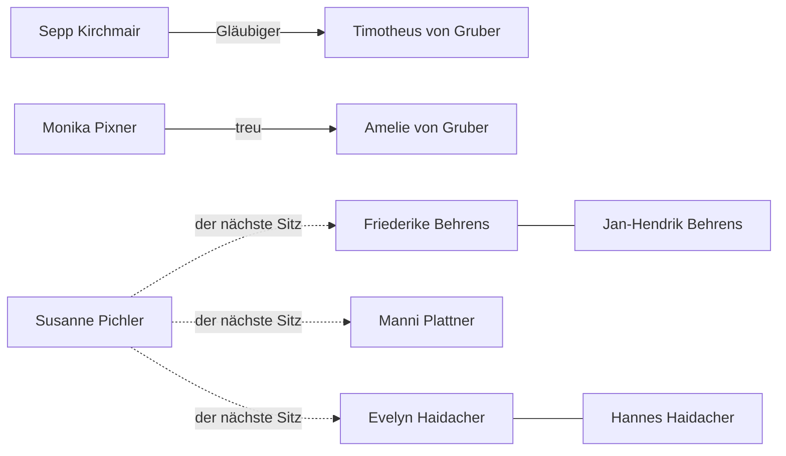
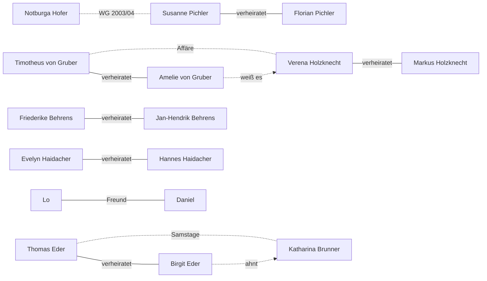
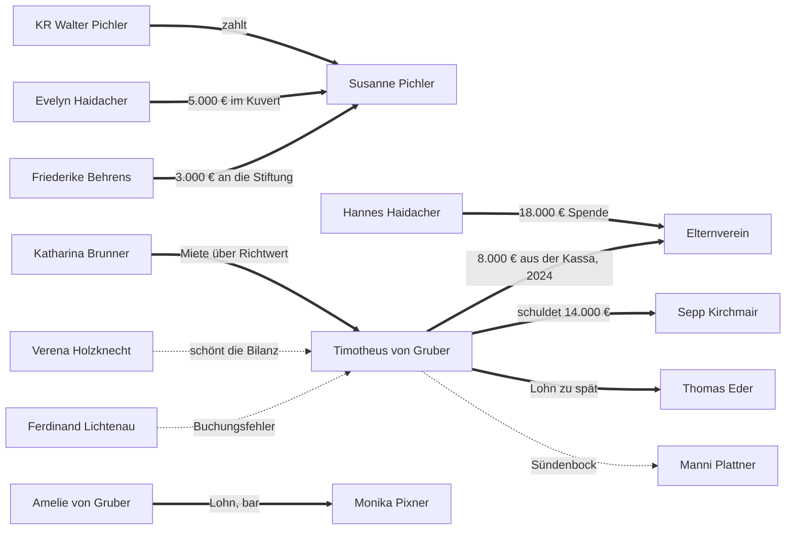
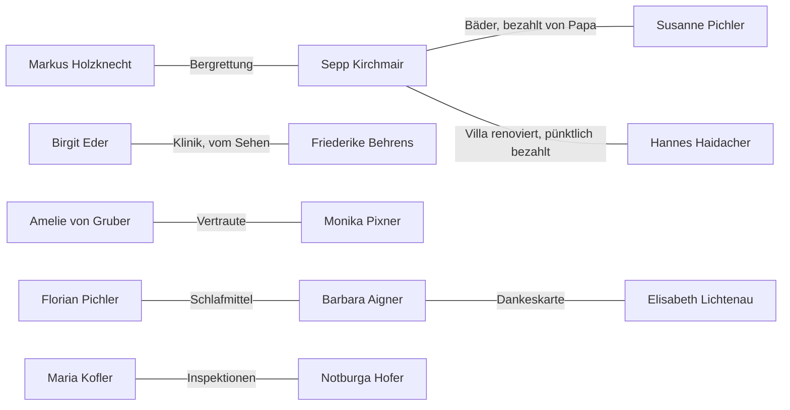
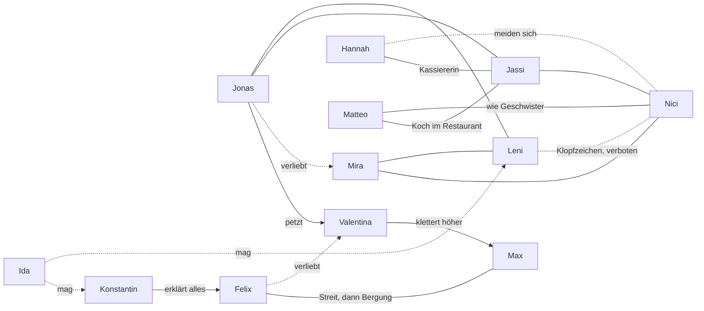
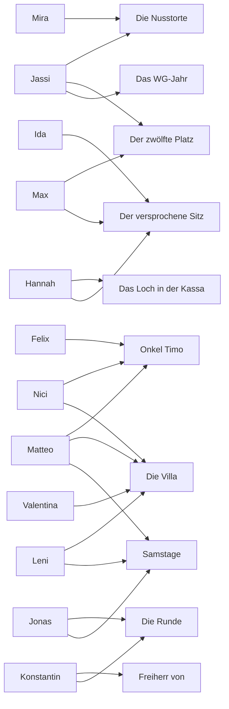

# Beziehungsnetz

Wer zu wem gehört, wer wem etwas schuldet, wer was weiß. Ein Klick auf einen Namen öffnet das Dossier.

**Legende:**
- Durchgezogene Linie: sichtbar, offiziell.
- Gepunktete Linie: heimlich, oder nur gefühlt.
- Dicker Pfeil: Geld.

## 1. Der Council: wie er sich zeigt, und wem er wirklich dient

- **Gezeigt:** 4:3 für Pichler.
- **Wie Susanne zählt:** 5:2. Brunner hat es ihr im Vertrauen gesagt.
- **Wahr:** 3:4 gegen sie.
- **Wie Timotheus zählt:** 4:3. Zu knapp für ihn.
- **Sway** ist kein Stimmrecht. Die beiden Köpfe wiegen gleich, 3:3, die Vorstandspaare auch, 5:5.

## 2. Die Familien draußen

- **Behrens, Plattner, Haidacher:** dreimal derselbe Sitz versprochen. Keine Familie weiß von den anderen. Siehe [[Der versprochene Sitz]].
- **Sepp** hält zu Gruber als Gläubiger, **Monika** zur Freifrau, nicht zum Freiherrn.

## 3. Ehen und Herzen

- **[[Onkel Timo]]:** die Affäre. **[[Samstage]]:** noch keine.
- **Ob die Holzknechts und die Eders zusammenbleiben,** hängt von Lo ab. Beide Wege sind möglich.

## 4. Geld

## 5. Brücken zwischen drinnen und draußen

## 6. Die Kinder

- **Kanon-Freundschaften** (beidseitig): Mira–Leni, Mira–Nici, Jonas–Leni, Jonas–Jassi, Jassi–Nici.
- **Leni und Nici** sind im Spiel nie Freundinnen (fr-055). Durch den Boden schon.

## 7. Wer plaudert was aus

Die Kinder verraten die Geheimnisse der Erwachsenen, ohne es zu wissen.

## 8. Erwachsene, die etwas wissen

| Wer | weiß | über |
|---|---|---|
| [[Maria Kofler]] | wessen Nusstorte es war, frühere Platzkäufe. Ein Foto der Allergieliste. | [[Susanne Pichler]] |
| Elisabeth Lichtenau | wessen Nusstorte es war | Susanne |
| [[Florian Pichler]] | das Kuvert, die Nusstorte | Susanne |
| [[Notburga Hofer]] | wer im WG-Jahr gezahlt hat | Susanne |
| [[Sepp Kirchmair]] | dass Papa Pichler bis heute zahlt | Susanne |
| [[Verena Holzknecht]] | die Bücher, die Kassa, die Belege zum Kuvert | [[Timotheus von Gruber]], Susanne |
| [[Ferdinand Lichtenau]] | das Loch in der Kassa, das Gesetz von 1919 | Timotheus |
| [[Amelie von Gruber]] | die Affäre, die Schulden | Timotheus, Verena |
| [[Monika Pixner]] | den Exekutor, das rote Auto, die Samstage | Timotheus, Verena, [[Thomas Eder]] |
| [[Manni Plattner]] | eine Kopie der Rechnung | Timotheus |
| [[Birgit Eder]] | ahnt eine Frau | Thomas, [[Katharina Brunner]] |
| [[Barbara Aigner]] | dass Florian Schlafmittel nimmt, aber nicht warum | Florian |
