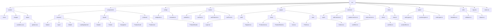

```mermaid

graph TD
    src["src/"]
    src_assets["assets/"]
    src_components["components/"]
    src_config["config/"]
    src_hooks["hooks/"]
    src_pages["pages/"]
    src_services["services/"]
    src_store["store/"]
    src_types["types/"]
    src_utils["utils/"]
    src_app["App.tsx"]
    src_index["index.tsx"]

    %% Assets
    src_assets_icons["icons/"]
    src_assets_images["images/"]
    src_assets_styles["styles/"]
    src_assets_styles_variables["variables.scss"]
    src_assets_styles_global["global.scss"]
    src_assets --> src_assets_icons
    src_assets --> src_assets_images
    src_assets --> src_assets_styles
    src_assets_styles --> src_assets_styles_variables
    src_assets_styles --> src_assets_styles_global

    %% Components
    src_components_common["common/"]
    src_components_layout["layout/"]
    src_components_products["products/"]
    src_components --> src_components_common
    src_components --> src_components_layout
    src_components --> src_components_products

    %% Common Components
    src_components_common_Button["Button/"]
    src_components_common_Input["Input/"]
    src_components_common_Modal["Modal/"]
    src_components_common_LoadingSpinner["LoadingSpinner/"]
    src_components_common --> src_components_common_Button
    src_components_common --> src_components_common_Input
    src_components_common --> src_components_common_Modal
    src_components_common --> src_components_common_LoadingSpinner

    %% Layout Components
    src_components_layout_Header["Header/"]
    src_components_layout_Footer["Footer/"]
    src_components_layout_Navigation["Navigation/"]
    src_components_layout --> src_components_layout_Header
    src_components_layout --> src_components_layout_Footer
    src_components_layout --> src_components_layout_Navigation

    %% Product Components
    src_components_products_ProductCard["ProductCard/"]
    src_components_products_ProductList["ProductList/"]
    src_components_products_ProductDetails["ProductDetails/"]
    src_components_products --> src_components_products_ProductCard
    src_components_products --> src_components_products_ProductList
    src_components_products --> src_components_products_ProductDetails

    %% Config
    src_config_endpoints["endpoints.ts"]
    src_config_constants["constants.ts"]
    src_config --> src_config_endpoints
    src_config --> src_config_constants

    %% Hooks
    src_hooks_useAuth["useAuth.ts"]
    src_hooks_useCart["useCart.ts"]
    src_hooks_useProducts["useProducts.ts"]
    src_hooks_useForm["useForm.ts"]
    src_hooks --> src_hooks_useAuth
    src_hooks --> src_hooks_useCart
    src_hooks --> src_hooks_useProducts
    src_hooks --> src_hooks_useForm

    %% Pages
    src_pages_auth["auth/"]
    src_pages_shop["shop/"]
    src_pages_user["user/"]
    src_pages --> src_pages_auth
    src_pages --> src_pages_shop
    src_pages --> src_pages_user

    %% Auth Pages
    src_pages_auth_Login["Login.tsx"]
    src_pages_auth_Register["Register.tsx"]
    src_pages_auth --> src_pages_auth_Login
    src_pages_auth --> src_pages_auth_Register

    %% Shop Pages
    src_pages_shop_ProductList["ProductList.tsx"]
    src_pages_shop_ProductDetail["ProductDetail.tsx"]
    src_pages_shop_Cart["Cart.tsx"]
    src_pages_shop --> src_pages_shop_ProductList
    src_pages_shop --> src_pages_shop_ProductDetail
    src_pages_shop --> src_pages_shop_Cart

    %% User Pages
    src_pages_user_Profile["Profile.tsx"]
    src_pages_user_Orders["Orders.tsx"]
    src_pages_user --> src_pages_user_Profile
    src_pages_user --> src_pages_user_Orders

    %% Services
    src_services_api["api.ts"]
    src_services_auth["auth.service.ts"]
    src_services_product["product.service.ts"]
    src_services_order["order.service.ts"]
    src_services --> src_services_api
    src_services --> src_services_auth
    src_services --> src_services_product
    src_services --> src_services_order

    %% Store
    src_store_slices["slices/"]
    src_store_store["store.ts"]
    src_store --> src_store_slices
    src_store --> src_store_store

    %% Slices
    src_store_slices_auth["authSlice.ts"]
    src_store_slices_cart["cartSlice.ts"]
    src_store_slices_product["productSlice.ts"]
    src_store_slices --> src_store_slices_auth
    src_store_slices --> src_store_slices_cart
    src_store_slices --> src_store_slices_product

    %% Types
    src_types_auth["auth.types.ts"]
    src_types_product["product.types.ts"]
    src_types_order["order.types.ts"]
    src_types --> src_types_auth
    src_types --> src_types_product
    src_types --> src_types_order

    %% Utils
    src_utils_formatters["formatters.ts"]
    src_utils_validators["validators.ts"]
    src_utils_helpers["helpers.ts"]
    src_utils --> src_utils_formatters
    src_utils --> src_utils_validators
    src_utils --> src_utils_helpers

    %% Main Files
    src --> src_assets
    src --> src_components
    src --> src_config
    src --> src_hooks
    src --> src_pages
    src --> src_services
    src --> src_store
    src --> src_types
    src --> src_utils
    src --> src_app
    src --> src_index

```

