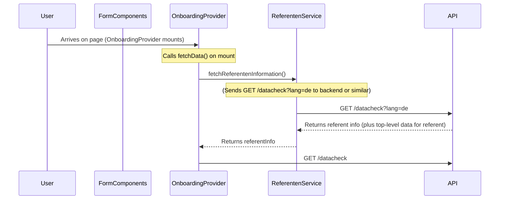

```mermaid
sequenceDiagram
    participant User
    participant FormComponents
    participant OnboardingProvider
    participant ReferentenService
    participant API

    User->>OnboardingProvider: Arrives on page (OnboardingProvider mounts)
    Note over OnboardingProvider: Calls fetchData() on mount

    OnboardingProvider->>ReferentenService: fetchReferentenInformation()
    Note over ReferentenService: (Sends GET /datacheck?lang=de to backend or similar)
    ReferentenService->>API: GET /datacheck?lang=de
    API-->>ReferentenService: Returns referent info (plus top-level data for referent)
    ReferentenService-->>OnboardingProvider: Returns referentInfo

    OnboardingProvider->>API: GET /datacheck

```

